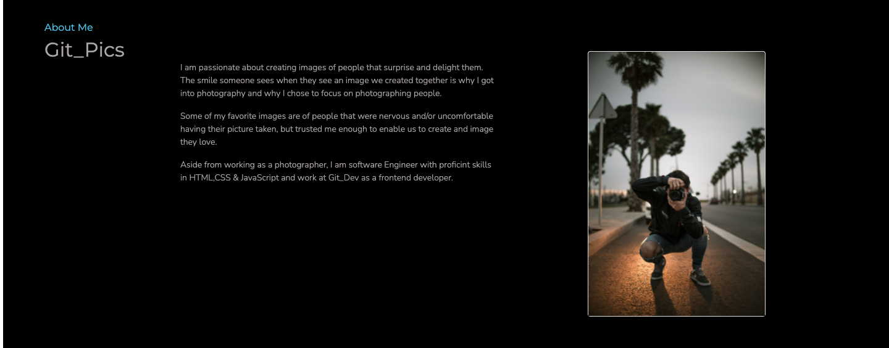
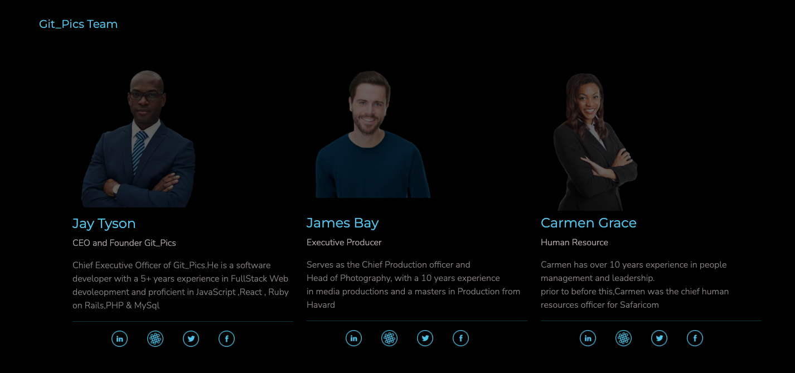
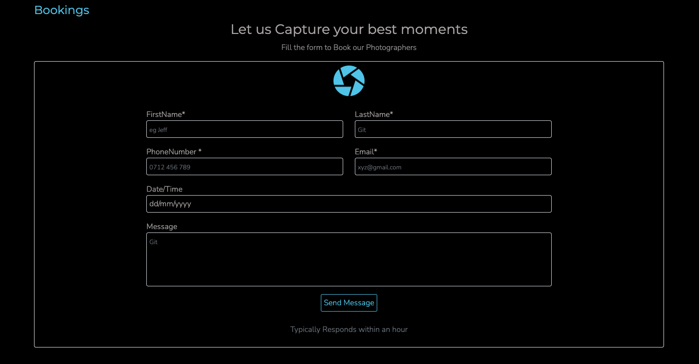

# Git_Pics
#### 22/04/2022
This is a basic portfolio Site for displaying information about a company.
#### By 
Geoffrey Gichaga .G

## Table of Content

+ [Description](#description)
+ [Installation Requirement](#Installation)
+ [Known Bugs](#Known-Bugs)
+ [Technology Used](#technology-used)
+ [Support and Contact Details](#Support-and-contact-details)
+ [Authors Info](#authors-Info)

## Description
This a school project to demonstrate knowledge on use of API's, it is porfolio site for a media company called Git_Pics ,the purpose of it is to give clients an overview of the company and shocase some of the projects they have worked on and also allow the them to search for different categories of projects where a Pexel API has been used to generate different pictures basing on the query.

## Desktop mode display:
### LandingPage

### About Us 

### Team 

### Projects 

### Booking 

### Footer 

 

## Setup/Installation Requirements
* Site can be accessed through the repo live link on the About Section
* A phone .tablet or a desktop computer
* Site is responsive to screens of upto 1200px

## Known Bugs
There are no known bugs ,if you spot one please dont hesitate to inform me.
## Technologies Used
Languages used in developing this site include:
* HTML 
* CSS
* Bootstrap
* Javascript
* Pexel API

## Support and contact details
You can report any issue you encounter with the site on [Email](geoffrey.githinji@student.moringaschool.com)

### Copyright (c) {year}
copyright (c) 2022.All rights reserved.

## Authors Info
LinkedIn - [Geoffrey Gichaga .G](https://www.linkedin.com/in/geoffrey-gichaga-234318ba/)

